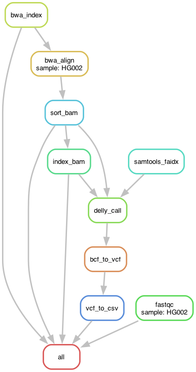

# Genomics Pipeline for Structural Variant Diagnostics

A Snakemake-based workflow for processing whole genome sequencing data to identify structural variants for clinical diagnostics. This pipeline takes patient FASTQ files and reference genome, then produces a clinical report of structural variants in CSV format.

## Table of Contents

- [Installation](#installation)
- [Project Structure](#project-structure)
- [Usage](#usage)
- [Pipeline Overview](#pipeline-overview)
- [Workflow Diagram](#workflow-diagram)
- [Output](#output)


## Installation

### 1. Install Miniforge (Conda for Apple Silicon)

For macOS M2 systems, use Miniforge instead of regular Anaconda:

```bash
# Download and install Miniforge
curl -L -O "https://github.com/conda-forge/miniforge/releases/latest/download/Miniforge3-MacOSX-arm64.sh"
bash Miniforge3-MacOSX-arm64.sh

# Follow the installation prompts, then restart your terminal
```

**Test your installation:**
```bash
conda --version
conda info  # Should show 'platform : osx-arm64' for M2 Macs
```

### 2. Install Snakemake

```bash
# Install Snakemake in base environment
conda install -c conda-forge -c bioconda snakemake

# Verify installation
snakemake --version
```

### 3. Clone and Setup Project

```bash
# Clone the repository
git clone <your-repo-url>
cd genomics-for-diagnosis

# Create all required conda environments
make setup-envs

# Test the workflow
make dry-run
```

## Project Structure

```
genomics-for-diagnosis/
├── README.md                    # This file
├── Makefile                     # Automation commands
├── .gitignore                   # Git ignore patterns
├── setup_envs.sh               # Environment setup script
├── config/
│   └── config.yaml             # Pipeline configuration
├── data/                       # Input FASTQ files
│   ├── HG002_R1_wgs_chr21.fastq.gz
│   └── HG002_R2_wgs_chr21.fastq.gz
├── ref/                        # Reference genome
│   └── chr21.fa
├── workflow/
│   ├── Snakefile               # Main workflow definition
│   ├── envs/                   # Conda environment specifications
│   │   ├── qc.yaml
│   │   ├── alignment.yaml
│   │   ├── svcalling.yaml
│   ├── rules/                  # Modular workflow rules
│   │   ├── reference.smk       # Reference genome indexing
│   │   ├── qc.smk              # Quality control
│   │   ├── alignment.smk       # Read alignment
│   │   └── svcalling.smk       # Structural variant calling
│   ├── scripts/                # Custom scripts
│   │   └── vcf_to_csv.sh       # VCF to CSV converter
│   └── results/                # Output files
│       ├── qc/                 # Quality control reports
│       ├── alignment/          # BAM files
│       ├── variants/           # VCF files
│       └── final/              # Final CSV output
└── logs/                       # Execution logs
```

## Usage

### Quick Start

```bash
# Run the complete pipeline
make run

# Alternative: Run with custom parameters
snakemake --use-conda --cores 8 --rerun-incomplete
```

### Available Commands

```bash
# Setup conda environments
make setup-envs

# Test workflow without execution
make dry-run

# Run the complete pipeline
make run

# Show available commands
make help
```

## Pipeline Overview

### Task Description

This pipeline addresses a clinical genomics scenario where:

**Objective**: Analyze a patient's whole genome sequencing data to identify pathogenic structural variants (SVs) for diagnostic purposes.

**Input**: 
- Patient FASTQ files (paired-end sequencing)
- Reference genome (FASTA format)

**Output**: 
- CSV file with structural variants containing columns: `CHROM`, `START`, `END`, `SIZE`, `QUAL`, `FILTER`, `SVTYPE`

**Clinical Relevance**: 
- Structural variants (>50bp) can cause genetic diseases
- Pipeline identifies deletions, duplications, inversions, and translocations
- Results assist medical geneticists in diagnostic decision-making

### Workflow Steps

1. **Reference Preparation**: Index reference genome for fast alignment
2. **Quality Control**: Assess sequencing data quality using FastQC
3. **Read Alignment**: Map sequencing reads to reference using BWA-MEM
4. **Structural Variant Calling**: Detect SVs using DELLY
5. **Export**: Convert VCF format to clinical CSV report

## Workflow Diagram



## Output

### Primary Output

**File**: `workflow/results/structural_variants.csv`

**Format**:
```csv
CHROM,START,END,SIZE,QUAL,FILTER,SVTYPE
chr21,1234567,1237067,2500,60.0,PASS,DEL
chr21,2345678,2346878,1200,45.0,PASS,DUP
chr21,3456789,3756789,300000,30.0,LowQual,INV
```

**Columns**:
- `CHROM`: Chromosome
- `START`: Start position
- `END`: End position  
- `SIZE`: Size of structural variant (bp)
- `QUAL`: Quality score
- `FILTER`: Filter status (PASS/LowQual)
- `SVTYPE`: Type (DEL/DUP/INV/TRA/INS)

### Additional Outputs

- **Quality Reports**: `workflow/results/qc/`
- **Alignment Files**: `workflow/results/alignment/`
- **Variant Files**: `workflow/results/variants/`
- **Execution Logs**: `logs/`