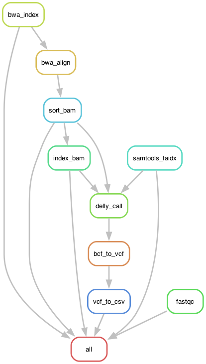

# Genomics Pipeline for Structural Variant Diagnostics

A Snakemake-based workflow for processing whole genome sequencing data to identify structural variants for clinical diagnostics. This pipeline takes patient FASTQ files and reference genome, then produces a clinical report of structural variants in CSV format.

## Installation
1. Download Miniconda3 installer and install conda
```bash
wget https://repo.continuum.io/miniconda/Miniconda3-latest-Linux-x86_64.sh -O miniconda.sh
bash miniconda.sh
```
2. Clone this repository:
   ```bash
   git clone <repository-url>
   cd genomics-for-diagnosis
   ```

3. Run the installation script and activate conda environment:
   ```bash
   chmod +x install.sh
   source install.sh
   ```

## Configuration

**Configure the workflow.**

-   **config files**:
    -   [`config.yaml`](/config/config.yaml) - main workflow configuration including sample names, file paths, tool settings, and resource allocation


-   **input files**:
    -   **Required data to be added by user**:
        - paired-end FASTQ files (place in `workflow/data/` directory):
          - `workflow/data/HG002_R1_wgs_chr21.fastq.gz` 
          - `workflow/data/HG002_R2_wgs_chr21.fastq.gz`
    -   **Provided reference data**:
        - reference genome: `workflow/data/fasta/chr21.fa`

-   **output files**:
    -   quality control reports in `workflow/reports/`
    -   **final clinical report**: `workflow/reports/HG002_structural_variants.csv`


**Note**: The example dataset uses chromosome 21 data from sample HG002. Place your paired-end FASTQ files in the `workflow/data/` directory. Update the file paths in `config/config.yaml` if using different sample names or file locations.

## Execution of the workflow

**Dry run** (recommended first step to check workflow validity):
   ```bash
   make dry-run
   ```

**Run the complete workflow**:
   ```bash
   make run
   ```

**Optional visualization and reporting:**
- Generate workflow DAG visualization:
  ```bash
  make generate-dag-graph
  ```
- Generate rule dependency graph:
  ```bash
  make generate-rule-graph
  ```
- Generate HTML report:
  ```bash
  make generate-report
  ```

## Workflow Overview



### Pipeline Steps

The genomics pipeline consists of 5 main stages:

1. **Reference Preparation** (`reference.smk`)
   - **`bwa_index`**: Creates BWA index files for the reference genome
   - **`samtools_faidx`**: Generates FASTA index for fast sequence access

2. **Quality Control** (`qc.smk`)
   - **`fastqc`**: Analyzes FASTQ files to assess sequencing quality and identify potential issues

3. **Read Alignment** (`alignment.smk`)
   - **`bwa_align`**: Maps paired-end reads to the reference genome using BWA-MEM
   - **`sort_bam`**: Sorts aligned reads by genomic coordinates
   - **`index_bam`**: Creates BAM index for efficient random access

4. **Structural Variant Calling** (`svcalling.smk`)
   - **`delly_call`**: Detects structural variants (deletions, duplications, inversions, translocations, insertions) using DELLY
   - **`bcf_to_vcf`**: Converts BCF format to compressed VCF with index
   - **`vcf_to_csv`**: Extracts key variant information into CSV format for clinical reporting

## Output Files

The workflow generates several output files for analysis and reporting:

### Final Clinical Report
- **`workflow/reports/HG002_structural_variants.csv`** - Main clinical report containing structural variants with the following columns:
  - `CHROM`: Chromosome location
  - `START`: Start position (1-based coordinates)
  - `END`: End position
  - `SIZE`: Size of the structural variant in base pairs
  - `QUAL`: Quality score from DELLY
  - `FILTER`: Filter status (PASS, LowQual, etc.)
  - `SVTYPE`: Type of structural variant (DEL, DUP, INV, INS, BND)

### Quality Control Reports
- **`workflow/reports/HG002_R1_wgs_chr21_fastqc.html`** - FastQC quality report for R1 reads
- **`workflow/reports/HG002_R2_wgs_chr21_fastqc.html`** - FastQC quality report for R2 reads
